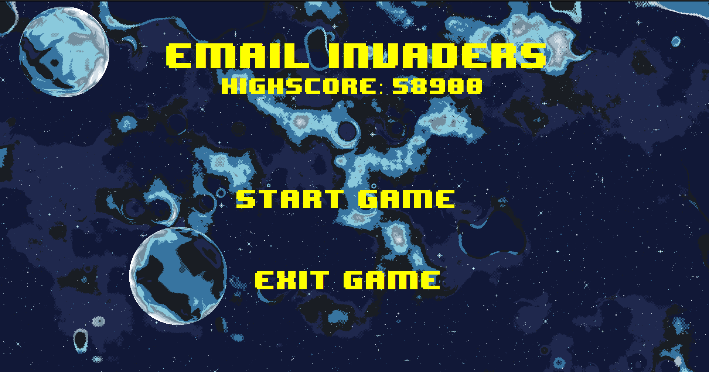
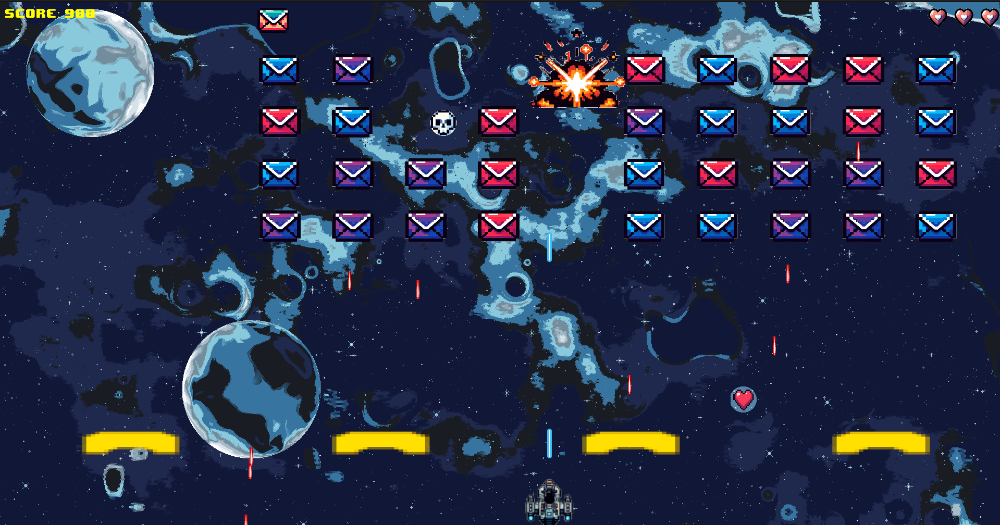
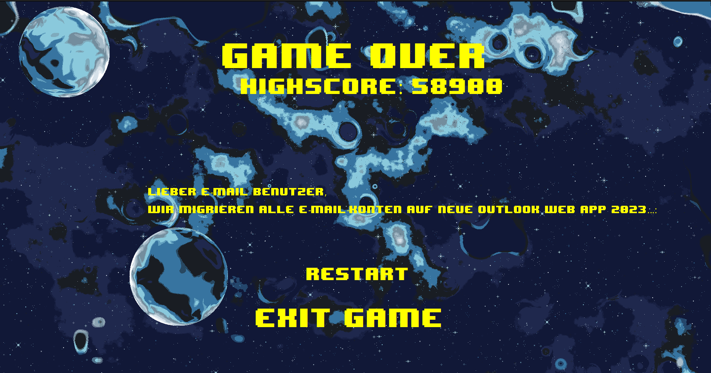

# Email Invaders

## Ausführung

chmod +x email_invaders.sh
./email_invaders.sh

_______________________________________________________________________________________________________________________

## Beschreibung

**Email Invaders** ist ein Arcade-ähnliches Spiel, inspiriert vom klassischen **Space Invaders**. Ziel des Spiels ist
es,
dein
Postfach vor einer Flut bösartiger Phishing-Mails zu verteidigen. Mit schnellen Reflexen und strategischem Geschick
kämpfst du gegen unerwünschte Eindringlinge und schützt deine digitale Sicherheit.

_______________________________________________________________________________________________________________________

## Features

**Klassisches Arcade-Feeling:** Erlebe den Nervenkitzel und die Herausforderung eines Retro-Arcade-Spiels.

**Steigernde Schwierigkeit:** Je länger du überlebst, desto schwieriger wird das Spiel.

**Power-ups:** Entdecke und nutze verschiedene Power-ups, um deine Chancen zu verbessern.

Viel Spaß beim Verteidigen deines Postfachs in Email Invaders!
_______________________________________________________________________________________________________________________

Das Menü:

_______________________________________________________________________________________________________________________

Gameplay:

_______________________________________________________________________________________________________________________

Gameover:

_______________________________________________________________________________________________________________________

## Funktionsweise

Navigiere dein Raumschiff mit den **Pfeiltasten** und feuere auf die eindringenden Phishing-Mails mit der **Leertaste**.
Dein
Ziel ist es, einen möglichst hohen Highscore zu erreichen, indem du die Angreifer abschießt. Jede zerstörte Mail erhöht
deine Punktzahl, wobei verschiedene Typen unterschiedliche Punkte und Eigenschaften haben.

In regelmäßigen Abständen taucht eine **Bonusmail** am oberen Bildschirmrand auf. Triffst du sie, bekommst du nicht nur
Bonuspunkte, sondern auch zusätzliche Leben. Wenn alle Feinde besiegt sind, erscheint eine neue Welle von Mails. Sollte
jedoch eine Mail den unteren Bildschirmrand erreichen oder du zu oft getroffen werden, ist das Spiel vorbei.

Mit abnehmender Zahl der Gegner steigt deren Geschwindigkeit und die Frequenz ihrer Angriffe. Diverse Power-ups mit
unterschiedlichen Effekten können aufsammelt werden, um dir Vorteile im Kampf gegen die Phishing-Flut zu verschaffen.

## Power-ups

_______________________________________________________________________________________________________________________

+ 1000 Bonuspunkte
  

_______________________________________________________________________________________________________________________

+ Man verliert Leben
+ Zerstört Mails auf dem Weg
  

_______________________________________________________________________________________________________________________

+ Man kann für 2 Sekunden schneller schießen
  

_______________________________________________________________________________________________________________________

+ Man gewinnt Leben dazu, aber man kann nicht mehr als 3 Leben haben
  